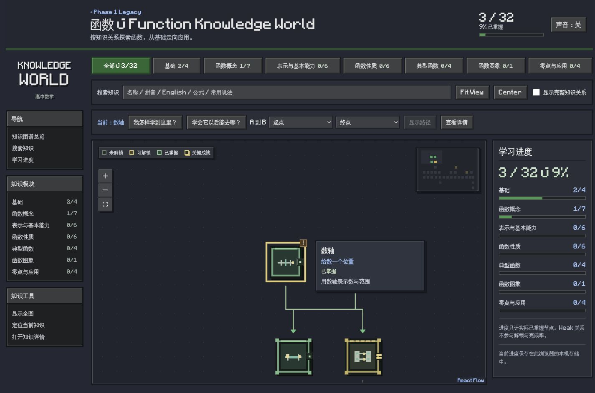
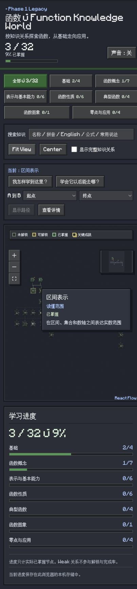

# Function World Wiki Refinement — Design QA

Updated: 2026-10-01 02:54:01 CST.

## Source of truth and comparison method

The owner's supplied Chinese Minecraft Wiki screenshot (3092 × 2260, rendered in chat at 1838 × 1344) defines the grouped layout and palette. The supplied Knowledge World screenshot defines the reported overlapping node text and bottom-anchored controls. No third-party page text was treated as project instructions.

Direct full-view comparison against these supplied references and browser-rendered screenshots below. Focused comparison used the graph/node region in the same full-view captures; a separate crop was unnecessary because tooltip text, neighboring nodes, controls, and MiniMap remain visible together.

## Browser-rendered evidence

- Desktop override: 1440 × 900; observed document client width 1425 (scrollbar excluded). Screenshot: `assets/phase-3/wiki-refinement/desktop.jpg`.
- Narrow override requested: 390 × 844; browser reported document client width 418 in the final DOM measurement. This confirms the narrow breakpoint, not an exact 390 CSS-pixel device certification. Screenshot: `assets/phase-3/wiki-refinement/mobile.jpg`.
- In both final DOM measurements, `scrollWidth` equals `clientWidth`.
- Temporary viewport override reset after checking.

## Five-surface comparison

| Surface | Reference intent | Implementation and result |
| --- | --- | --- |
| Typography | Owner explicitly selects Minecraft.ttf; formulas unchanged | Font loaded; drawer uses KnowledgeMinecraft; sampled formula glyphs use KaTeX_Math |
| Layout | Left grouped navigation, category strip, main content, right panels | Left navigation and seven unchanged modules; central graph; right progress; narrow layout stacks progress |
| Color | Blue-gray panels, gray beveled buttons, green selection, blue links | Scoped palette replaces previous all-green shell; node state colors retained for meaning |
| Assets | Reference is visual direction; original mathematical identity remains | Existing MathCraft icons/frames preserved; no game/Wiki logos or hero images added |
| Content and functions | Original learning functions remain | Search, modules, paths, progress, Weak toggle, unlock, details retained; graph/content fixtures unchanged |

## Comparison history

1. P1: node tooltip painted under neighboring nodes and inherited graph scale. Moved tooltip to a separate screen-space layer, removed outer feedback transforms. Final desktop evidence shows readable node text above its neighboring node.
2. P2: resizing the container could leave the prior fitted viewport and crop the graph unexpectedly. Added resize observation and refit, preserving active module focus. Intentional close-up zoom may still show only part of the graph; Fit View remains available.
3. P2: MiniMap exterior resized but its default 200 × 150 SVG did not. Made the SVG follow the frame. Final mobile evidence shows the entire MiniMap within its compact border.
4. P2: focused-node tooltip could remain clamped onscreen after panning the node away. Offscreen-node guard added.

## Functional checks

- Initialized number line and set nodes; progress moved 0 → 1 → 2; interval and mapping became available.
- Finished initialization; unlocked interval normally; progress became 3/32 and Detail Drawer opened.
- Formula rendering retained KaTeX fonts.
- Search for 单调 returned matching nodes; selecting monotonicity positioned it; prerequisite path displayed 4 nodes / 3 relationships.
- Complete-relations checkbox added Weak relations and returned to Strong-only when unchecked.
- Module navigation and Fit View operated; floating controls and MiniMap remained inside graph.
- Browser console error entries: none in checked interactions.
- Typecheck, lint, build passed; interaction-model unit tests: 5 passed.

## Intentional adaptations and remaining follow-up

The game-specific grass/banner and news content are not part of the mathematical product. The UI matches the requested module organization and palette, not the unrelated page contents. New full-screen effects are deferred; motion hooks and reduced-motion support are prepared. The supplied font is approximately 16 MB; subsetting is optional future optimization. Exact device emulation and exhaustive browser regression were not performed.

No actionable P0/P1/P2 findings remain in the checked scope. No deployment or knowledge-data mutation.

final result: passed

## Follow-up: font and responsive brand recovery (2026-10-01)

Scope: the owner's three browser annotations and three supplied PNG logos. Earlier checks did not detect the formula's inherited light background or the supplied font's middle-dot / multiplication-sign rendering. The earlier pass is superseded for those surfaces by this check.

### Findings, fixes, and post-fix evidence

- P1, formula: old shared `.formula` background was light while the dark drawer assigned light KaTeX text. Scoped a dark background to the drawer's formula container; preserved KaTeX font rendering. DOM: background `rgb(31,38,49)`, text `rgb(232,237,245)`, sampled math font `KaTeX_Math`. Desktop and compact Detail Drawer opened and closed successfully.
- P2, progress: middle-dot rendered incorrectly and the long metric wrapped in the narrow sidebar. Split into count and percentage lines; use system tabular numerals for this metric only. Other UI text retains Minecraft. Screenshot shows `3 / 32` and `9% 已掌握` without overflow.
- P2, close control: replace font-dependent `×` with the readable label `关闭`; accessible name stays `关闭详情`.
- P2, other symbols: restrict the supplied pixel font's unicode range to ASCII and Chinese blocks. Mathematical symbols, middle-dot and arrows fall back to the normal UI fonts; KaTeX retains its own font families.
- Brand: directly integrate original supplied PNGs, not a text reconstruction. `<picture>` selects 1280 × 720 for >=1200px, 960 × 540 for 701–1199px, 64 × 64 for <=700px. Larger source images retain their proportions; only transparent surrounding padding is hidden by the logo slot. Compact logo renders at native 64 × 64, not stretched.

### Source and rendered comparison

Source assets: `/Users/ginex/Downloads/minecraft-text-1280x720.png`, `minecraft-text-960x540.png`, `minecraft-text-64x64.png`; source pixel dimensions match their filenames. Browser annotation screenshots are the before-state evidence for the three defects.

Rendered evidence under `assets/phase-3/font-logo-recovery/`:

- `large.jpg`: requested 1366 × 900 viewport; document width 1351 after scrollbar. Selected 1280 source.
- `medium.jpg`: requested 1089 × 832 viewport; document width 1074. Selected 960 source.
- `compact.jpg`: requested 390 × 844 viewport; document width 375. Selected 64 source; no horizontal document overflow.
- `detail.jpg`: default desktop viewport, same interval node as the annotations, formula and close label both visible.
- `compact-detail.jpg`: 390px-wide drawer; same formula font and close behavior checked.

The source PNGs and corresponding browser screenshots were opened together for full-view and focused logo comparison. Assets were compared by their visible logo content rather than their large transparent canvases. Browser UI is captured at CSS resolution; no 1:1 screen-layout match to a standalone PNG was claimed. Annotation states are compared by the same interval formula, 3/32 progress and close control; capture sizes differ from the supplied screenshots.

Five-surface result: typography now separates pixel UI from numeric metrics and mathematical symbols; layout remains scoped to the annotated controls and logo slots; formula contrast is repaired without altering the palette; the exact source logos render sharply without artwork changes; content, progress and knowledge relations remain unchanged.

Typecheck, lint and build passed. Checked browser console has no error entries. Temporary viewport overrides reset. No deployment, new routes, graph edits or progress mutations in this follow-up. Exact physical-device and exhaustive browser testing remain outside this check.

final result: passed
