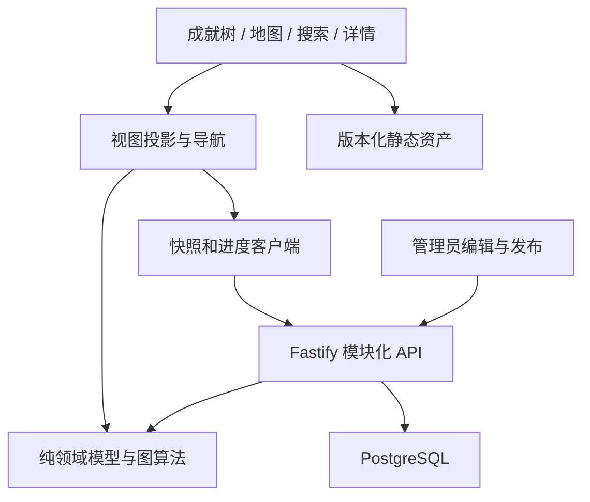

# Phase 0 架构总览

**决定：以模块化单体建立产品，用关系表维护知识图谱、不可变发布快照服务学习端、纯领域模块计算状态与路径。**

## 1. 输入与边界

依据四份原件，优先级：本次用户 Phase 0 限定 > PRD 产品规则与质量规则 > Schema 字段示意 > MASTER PROMPT 的完整开发愿景。PRD 与 Schema 重复字段按同一模型处理。没有完整知识图谱附件，只有质量控制规则，因此本轮完成规则建模，不宣称审核过 350 个节点。

固定规则：知识始终可读；普通点击 Available 才解锁；首次初始化可补齐全部强祖先；撤销不级联；弱依赖默认不显示且不参与解锁；初中节点有“初中”标签，不进入高中统计；数学名主、成就名辅；无 XP/Level；图谱编辑与学习操作分权；AI 内容生成仅预留。

需要明确化的原文细节：

|问题|本阶段决定|
|---|---|
|Schema 英文名可选，而 Master 要求英文名|草稿可缺；正式发布节点必须补齐英文名|
|图谱 DAG 是否含 Weak|发布图的全部 enabled 边要求无环；解锁、学习路径及传递约简仅用 Strong|
|传递边有“独立直接意义”是否保留|V1 采用严格 Strong 传递约简；不自动删除，送人工复核，可改 Weak 保留辅助关系|
|非级联撤销后后继状态|已有掌握记录优先为 Unlocked，并另行展示缺失前置，不覆盖掌握事实|
|无先修是否孤岛|经审核声明 isRoot 且给出原因才允许根节点；独立单节点也须复核|
|Path Between 有多条路|显示所有有效有向 Strong 路径的并集，不只取最短路径；额外先修标记在面板|
|导数 LIMIT 等示例 ID|只是格式示意，不视为必须建立的高考考点|

## 2. 确定技术栈

|层|选定|理由与限制|
|---|---|---|
|运行环境|Node.js 24 LTS，TypeScript strict，pnpm workspace|前后端共享领域契约；精确补丁版在 Phase 1 安装时冻结|
|前端|React + Vite + React Router|以客户端交互画布为中心，V1 不需要 SSR；本轮仅目录|
|图画布|@xyflow/react（React Flow）|符合原文要求，复用镜头、节点、MiniMap 能力|
|自动布局|elkjs layered，Web Worker|多父节点 DAG 与跨领域布局；手工覆盖由适配层处理|
|状态|Zustand 管视图；TanStack Query 管远程快照/进度|避免把 React Flow nodes 当作知识真值|
|UI|CSS Modules + CSS variables|游戏化边框、主题、现代详情页可独立维护；不先引入庞大组件体系|
|数学内容|Markdown + KaTeX，禁用原始 HTML 与可执行 MDX|专业公式；内容按需读取与消毒|
|API|Fastify，同源 /api/v1 REST；JSON Schema 校验|模块化插件组织，无需微服务、GraphQL 或消息中间件|
|数据库|PostgreSQL 18 + node-postgres(pg) + 编号 SQL migrations|关系表、约束、事务与递归查询；SQL 是唯一结构来源，不维护第二套 ORM schema|
|资产|S3-compatible 对象存储 + CDN；PostgreSQL 元数据|本轮只选协议，不开通供应商；开发阶段可用本地静态目录适配器|
|测试|Vitest、fast-check、Testing Library、Playwright、真实 PostgreSQL|分别覆盖业务算法、性质、交互、流程、事务|
|运维|同源静态前端 + Node 服务 + 独立 PostgreSQL|可容器化；托管地点与费用在部署前确定，本阶段无部署|

备选与取舍：Next.js 的 SSR 当前收益较小；Dagre 更轻但复杂 DAG 调整能力不足；Neo4j 违背输入明确约束；Canvas/Pixi 全自绘需重做可访问性与命中测试。400 左右知识点无需先引入 Redis、搜索集群或微服务。

技术资料（2026-09-06 查阅）：[React 对 Vite 的说明](https://react.dev/learn/build-a-react-app-from-scratch)、[Vite 起步](https://vite.dev/guide/)、[XYFlow 与 ELK 集成](https://reactflow.dev/examples/layout/elkjs)、[XYFlow 性能建议](https://reactflow.dev/learn/advanced-use/performance)、[Fastify 校验](https://fastify.dev/docs/latest/Reference/Validation-and-Serialization/)、[Node.js 24 LTS](https://nodejs.org/en/blog/release/v24.11.0)、[PostgreSQL 版本支持](https://www.postgresql.org/support/versioning/)。这些资料支撑选型，不构成本项目性能或集成验证结果。

## 3. 模块关系

packages/domain 无 React/DB 依赖；graph-core 依赖 domain；database repository 依赖 domain；API 组合三者。前端不得导入数据库或服务端凭据模型。Graph Engine 是查询与表现的组合，不持有登录权限或写数据库。后端权威校验不信任客户端计算结果。

目录：apps/web、apps/api 是部署边界；packages/domain、graph-core、database 是共享模块；docs、content、assets、tests、infra 为独立职责目录。每个暂未实现目录有 README 说明，不以空入口冒充可运行应用。

## 4. 数据表及来源映射

|表|责任与关键约束|
|---|---|
|users / sessions|用户名大小写不敏感唯一；密码哈希仅服务端；会话只保存 token 哈希|
|math_domains / math_modules|领域和模块；模块归属通过复合外键约束|
|knowledge_nodes|稳定永久 ID，字段与原 Schema 对齐；草稿内容，初中标签和等级约束|
|knowledge_edges|source=先修，target=后续；禁自环和同向重复；rationale 非空；审核字段|
|graph_releases / graph_head|完整审核快照与当前发布指针；历史快照不可修改|
|user_progress_state|用户事务锁、revision、初始化完成时间；非每节点状态表|
|user_unlocked_nodes|存在即已掌握；不存在由图谱推导 Locked/Available；来源枚举避免布尔组合歧义|
|progress_commands / achievement_events|幂等响应与真实状态变化事件；事件不直接决定探索度|
|map_regions / map_landmarks|一级领域、二级模块区域；关键成就链接；归一化坐标|
|node_layouts|领域、布局版本、自动/人工坐标；不受用户掌握变化驱动|
|assets|不可变版本资源、来源、许可、裁切和审核元数据|
|admin_audit_events|内容与边更改、审核和发布的审计记录|

核心表保持关系化；公式、教材引用和素材 provenance 用结构化 JSONB，不将依赖藏在节点 JSON 中。SQL 只校验 JSON 顶层类型，嵌套字段由 Phase 1 API 的运行时 schema 和发布器校验。

UserProgress 是 DTO 投影：status 不入表；manuallyUnlocked / initializationUnlocked 从 source 推导。import 不冒充 manual。worldLandmark 从 map_landmarks 派生；Domain.mapRegionId 从一级区域关系派生；iconAsset 对应 assets.id，URL 在响应时解析。snake_case 数据库字段与 camelCase 领域字段在 repository 单一映射。

## 5. 图谱发布与进度版本

编辑表存草稿及稳定节点身份。学习端只读 graph_head 指向的 graph_releases.snapshot，不能读实时草稿。snapshot 除领域类型的图结构外，包含已审内容、布局、区域/地标及资产引用；对外摘要接口裁去详细内容。全量约 400 节点时，整图不可变快照是可接受的 V1 简化，后续可迁移按实体版本关系表。

管理员发布事务：取得统一图编辑 advisory transaction lock → 读取完整候选图 → 验证内容、DAG、重复、传递约简、前置数量及资源 → 建立规范化 JSON 和 SHA-256 → INSERT release → 原子替换 graph_head → 审计 → 提交。所有编辑/审核/发布均取得相同锁；校验失败不移动指针。审核不能只在前端做。发布器与锁规则尚未实现，本 SQL 不独自保证 DAG。

REVIEW_REQUIRED 的 enabled 依赖会阻断候选图发布，不能简单过滤它然后让 target 变成“无前置”。管理员可明确禁用或复核解决；所有发布节点必须 APPROVED，退休节点不进入新快照。改变已审核数学内容或边自动重置审核状态（Phase 1 服务职责）。

永久 ID 不重命名、不复用；后台删除操作默认 retired=true，保留进度外键。发布更新不会级联删除已有解锁。分母采用当前发布快照内 high_school 节点，而非固定 350；归档节点进度保留但不统计。旧用户的知识进度可能因新版本分母改变，界面显示内容版本更新说明。历史版本回退通过移动 head 实现，不修改历史快照；需与进度命令使用同一锁序。

## 6. 数据一致性与权限边界

进度命令以 graph_head 的 SHARE 行锁固定版本，再锁 user_progress_state；发布用 graph_head UPDATE 锁。命令的 release 不匹配返回 409，不暗中换版本。一次命令完整写入进度、事件、revision 与幂等结果。稳定锁序 head → user；发布不能反向锁用户。初次注册创建 progress_state。

数据库只接受服务端连接。Phase 1 建立 migration_owner（DDL）、learning_api（只读 release、读写用户进度/会话）与 content_admin（草稿/发布）独立权限连接；学生请求不得使用 owner。行级用户隔离由认证 middleware + repositories 的强制 user_id 参数执行，并用双账号集成测试验证；V1 不声称已经实现 RLS。API 不接受请求体 userId 作为权限来源。
