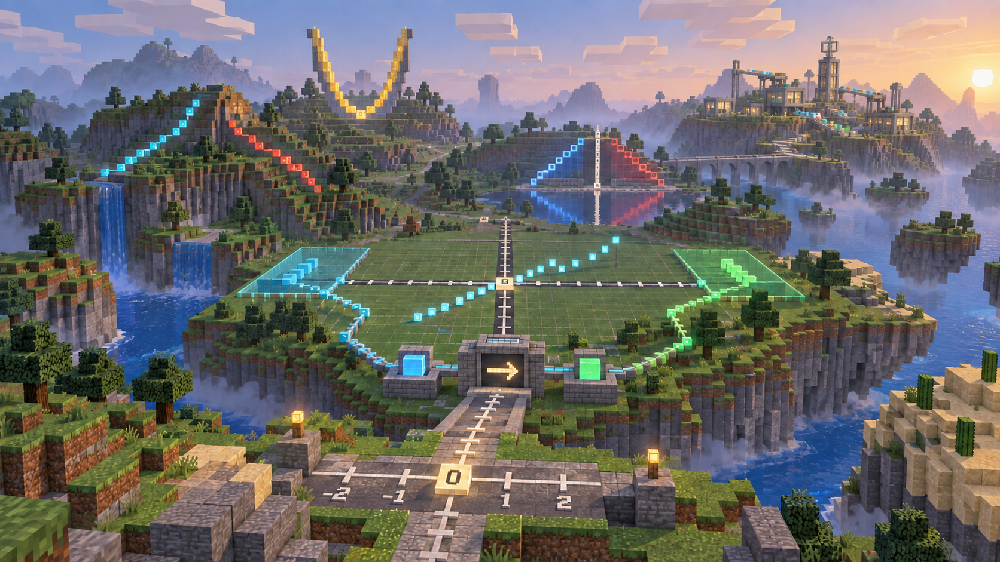

# Function Dimension — Visual Master v2

状态：`DEPRECATED / NOT FOR PRODUCTION`（原状态：`P3A_ART_DIRECTION_DRAFT`）。Function Dimension / World Map 已退出 Phase 3；本图只作设计探索记录，禁止继续 4K Production Master。现行规范见 [UI Visual Bible](./PHASE-3-UI-VISUAL-BIBLE.md)。  
日期：2026-09-26。  
资产：`assets/phase-3/function-realm-visual-master-v2.png`。  
实际原生尺寸：1672×941（近 16:9），不是 3840×2160。内置生成工具未提供本次原生 4K 输出；不能把简单放大当作原生 4K。

## 方向检查

- **通过（方向层面）**：主体由方块地形、像素云、方块树、水和道路构成；不是上一稿的写实奇幻绘画。数轴道路、坐标轴 Block Path、离散函数图象、输入/输出区域、U 形抛物线与远景模型工坊均进入同一世界语法。
- **待复核**：画面中的刻度数字、零点位置、函数映射及镜像/对称构造是概念画线索，尚不能保证每处数学关系严格正确；不得作为可直接教学的精确图示。
- **待复核**：虽然未使用原始游戏资产文件，常见草地/石块/方块树造型仍有很强的同类游戏视觉联想。正式商业化使用前需逐项检查材质与结构原创度。
- **未通过**：原生 4K 像素规格。P3A 不标为最终验收完成，不据此批量生产图标或集成 UI。

上一张 [v1 母图](./FUNCTION-REALM-VISUAL-MASTER.md) 属已撤销的 Fantasy RPG 方向，仅保留历史对照，不得复用为视觉基线。Phase 2 Graph、Ontology、Dependency、Detail 均未改动。

## 生成记录

模式：内置 `image_gen`；先从零生成一张 `stylized-concept` 方块世界母图，再基于它做一次 `precise-object-edit`，仅将远景神殿式建筑与浮空地形修正为原创数学模型工坊及普通方块远山。最终交付的是修订图。

最终新图基础提示的关键约束：**“Mathematics determines the block world's structures. At first glance a Minecraft-style block/voxel/pixel sandbox world; at second glance an original high-school mathematics dimension. Foreground number-line block road; midground coordinate grid, input/function/output machine, discrete block graph; distant mirrored structures, U-shaped parabola and mathematics model workshop. Natural block palette, visible voxel fog. No original Minecraft textures/items/UI, no fantasy RPG, castle, temple, magic, photoreal terrain, glossy UI, floating formulas or copied game assets.”**

定点修订提示：**“Preserve the camera, number-line road, function machine, coordinate grid, discrete block graph, input/output regions, parabola, mirrored stepped structures and voxel fog. Replace only the far classical temple with a block-built Mathematics Model Workshop containing modular workbenches and input/output conveyors; remove generic floating islands. Keep all other geometry and positions. No text, labels, characters, UI, logos, watermarks or copied game assets.”**
