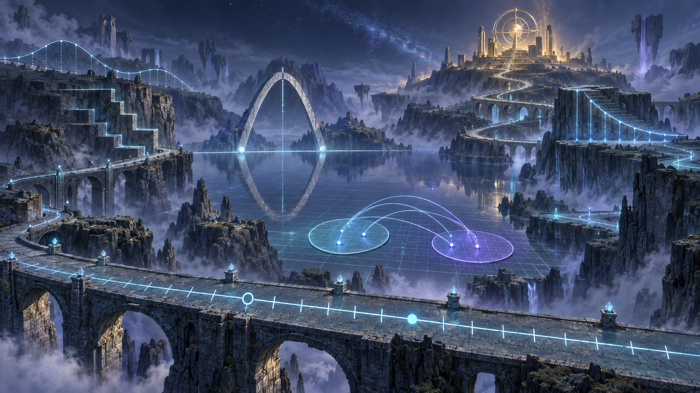

# Function Realm · 函数之境 — Visual Master v1

状态：`DEPRECATED / NOT FOR PRODUCTION`（原判定：`SUPERSEDED / REJECTED_BY_P3_VISUAL_BIBLE_V2`）。本图保留作历史对照，**不得作为后续图标、背景或 UI 的视觉基线**。现行 Phase 3 只做 Advancement UI，见 [UI Visual Bible](./PHASE-3-UI-VISUAL-BIBLE.md)。  
日期：2026-09-26  
产物：`assets/phase-3/function-realm-visual-master-v1.png`  
实际原生尺寸：1672 × 941 px（约 16:9）；**不是原生 3840 × 2160 4K**。

本图只用于 Phase 3A 美术方向审批，不是可直接铺进 Graph 的最终背景。Knowledge Graph 的精确节点、Strong/Weak 关系与状态仍由产品图谱承载；Realm 母图负责空间记忆、视觉叙事与地标层级。未更改 Phase 2 的 Ontology、Dependency 或 Detail Content。

## 本轮视觉检查

- 前景数轴道路有均匀刻度及空心/实心端点；中景坐标网格成为地表，而非覆盖在普通地图上的装饰图层。
- 左侧分段阶地、中央抛物线拱门与近景映射区域由数学形状构成；路径引向远处暖金观测地标。
- 未抵达区域采用“可见但低细节”的雾；冷色环境与暖金终点形成奖励层级。
- 未使用 Minecraft 原版材质、物品、UI、字体或音效；图中无文字、水印和角色。
- 待下一轮确认：该图更偏写实概念绘画，像素/方块语言较克制；零点石碑和严格对称的湖面语义尚不够明确。批准方向前不应以它批量生成 32 个图标。

## 生成记录

模式：内置 `image_gen`，从零生成，非图像编辑；用途分类：`stylized-concept`。

最终使用的生成提示：

> Use case: stylized-concept  
> Asset type: Phase 3A art-direction approval master image for Minetoast, Function Realm (函数之境). Create ONE original 16:9 cinematic landscape key art, designed for a 3840×2160 master canvas. No interface mockup.
> Scene and structure: Mathematics itself has become a navigable fantasy landscape. Wide oblique elevated view with strong near-to-far depth. In the foreground, a broad ancient road IS a number line: evenly spaced integer ticks carved into the path, clearly ordered around zero; interval-bridge endpoints use one open ring and one filled marker. The midground is a valley whose ground geometry IS a subtle x/y coordinate grid; two clearly bounded set-regions are connected by a small number of precise luminous mapping beams. A graceful parabolic stone arch, a mirror-symmetric lake, and stepped piecewise terraces emerge naturally from mathematical shapes. A continuous curve-derived ridge and the main illuminated learning roads carry the eye through the world. Where a curve crosses a horizontal axis, a pair of restrained glowing Zero Stones mark the intersections. In the distant high ground, one original warm-gold mathematical observatory/monument acts as a Key Achievement landmark. The roads form a meaningful progressing network rather than random fantasy paths. Unreached regions remain fogged but visibly legible; reached routes and structures wake with cool cyan light.  
> Art direction: original fantasy-world concept art with restrained voxel/pixel-edge language, not a literal videogame screenshot. Atmospheric but spatially coherent, readable large shapes, layered terrain, precise mathematical geometry integrated into terrain and architecture, sophisticated painterly lighting, tactile stone and crystalline mathematical energy. Deep midnight blue-gray environment, cool teal/cyan mathematical structures, subtle magical violet depth, sparse warm gold only at the far landmark. A quiet sense of discovery and achievable distance.  
> Composition: foreground foundations at bottom, conceptual gateway and representations in midground, properties and typical function forms across elevated terrain, zero/model application near distant destination; clear visual journey. Keep a slightly quieter region that could later support UI overlays, but this image itself has no UI.  
> Constraints: no text, labels, formulas, logo, watermark, characters, generic castle, conventional trees/river as major features, or arbitrary pasted-on mathematical symbols. Do not copy Minecraft materials, items, UI frames, fonts, sounds, or recognizable game assets. No chart pasted over a fantasy background; the mathematical structures must constitute the world itself.
